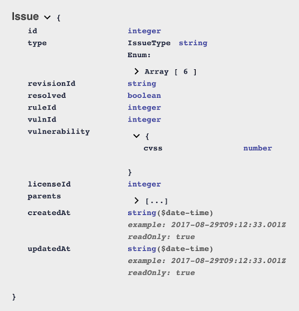

# Product Operations Manager Interview 

## Background 

Product Operations Managers are frequently fielding requests from large enterprise customers who are trying to adapt the data that FOSSA provides into a format that they can use. 

This is a domain-specific question. You're totally not expected to know everything so ask any questions to clarify the problem. 

## Problem

FOSSA currently returns a set of Issues in the following format ([example found here](./sample-issues-response.json)).

However, one of our large customers is requesting a different format ([example found here](./customer-api-request.json)).

## Part 1: Short-Term Solution 

As a short-term solution, we'd like you to author a short script to help a customer convert the Issues that FOSSA returns into their desired format. Feel free to use whatever tools that you are comfortable with.

## Part 2: Long-Term Solution

How would you present this feature request to the product team? 

